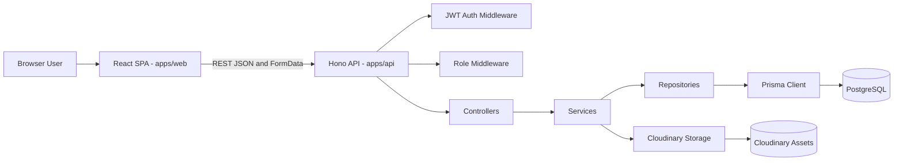
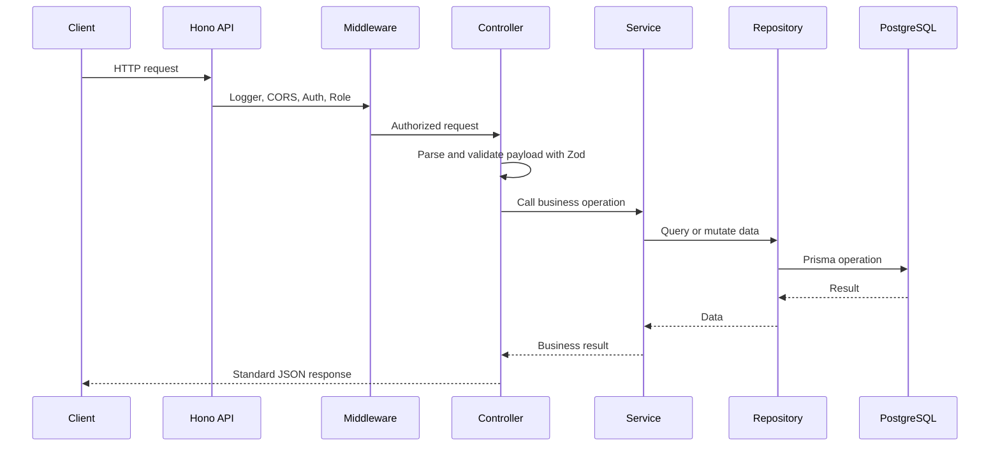
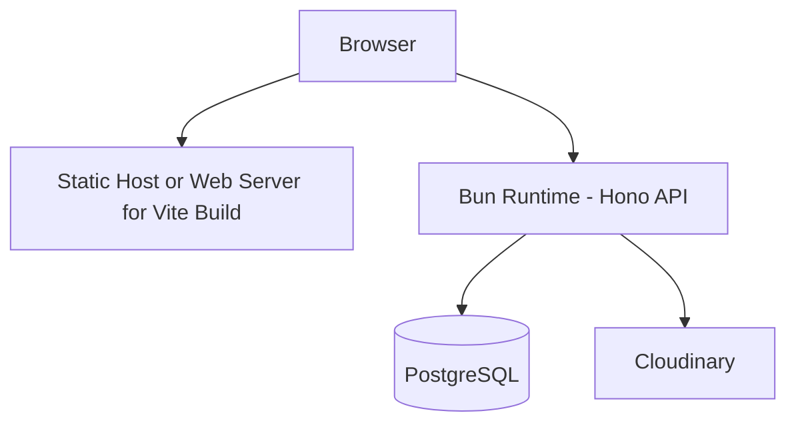
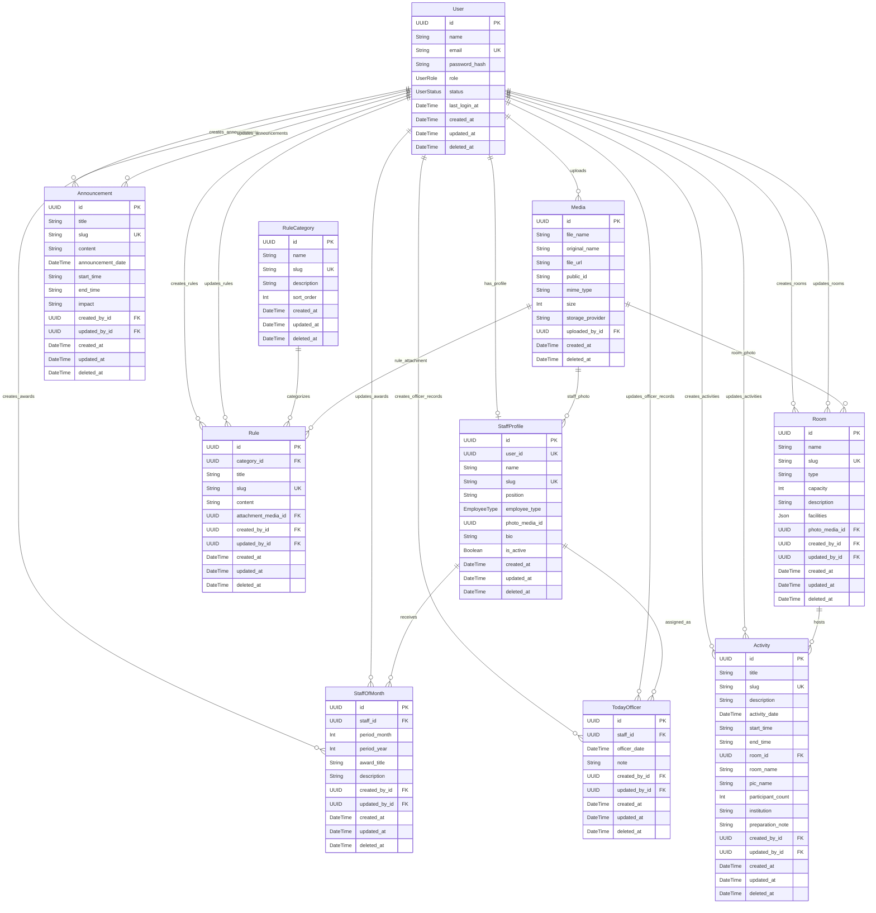

# DOKUMENTASI SISTEM INFOBASE UPPJPDS

## Document Control

| Item | Description |
| --- | --- |
| Document Title | Dokumentasi Teknis dan SRS INFOBASE UPPJPDS |
| System Name | INFOBASE UPPJPDS |
| Version | 1.0 |
| Date | 2026-07-03 |
| Prepared From | Source code repository `/Users/sagara/project/freelance-perpus` |
| Documentation Standard | Structured technical documentation with SRS-style requirement identifiers |
| Scope | Architecture, data model, ERD, API, SRS functional and non-functional requirements, and factual source-code analysis |

## 1. Executive Summary

INFOBASE UPPJPDS adalah aplikasi informasi untuk UPT Perpustakaan Jakarta dan PDS H.B. Jassin. Sistem menyediakan portal publik, area internal petugas, dan panel administrasi untuk mengelola tata tertib, pengumuman, agenda, staff of the month, today officer, profil pegawai, profil ruangan, media, dan user.

Berdasarkan source code, sistem dibangun sebagai aplikasi web full-stack dengan pemisahan frontend dan backend:

| Layer | Implementation |
| --- | --- |
| Frontend | Vite, React, TypeScript, React Router, TanStack React Query, React Hook Form, Zod, Tailwind CSS, Lucide React |
| Backend | Bun runtime, Hono REST API, TypeScript |
| Database | PostgreSQL melalui Prisma ORM |
| Authentication | JWT HS256 melalui `jose`, password hashing dengan `bcryptjs` |
| Authorization | Role-based access control: `PNS` dan `PJLP` |
| Media Storage | Cloudinary |
| Validation | Zod schema pada API dan form login frontend |

Sistem menerapkan arsitektur modular dan layered pada backend dengan pola `routes -> controller -> service -> repository -> Prisma`. Frontend memakai React SPA dengan protected route berbasis role dan konfigurasi generik untuk halaman CRUD admin.

## 2. Source Code Basis

Dokumentasi ini disusun berdasarkan inspeksi file berikut:

| Area | Source Path |
| --- | --- |
| Project overview | `README.md` |
| API entry point | `apps/api/src/index.ts` |
| Backend modules | `apps/api/src/modules/*` |
| Backend middleware | `apps/api/src/middlewares/*` |
| Backend config | `apps/api/src/config/*` |
| Prisma schema | `apps/api/prisma/schema.prisma` |
| Migration SQL | `apps/api/prisma/migrations/20260617000000_init/migration.sql` |
| Seed data | `apps/api/prisma/seed.ts` |
| Frontend router | `apps/web/src/app/router.tsx` |
| Frontend auth provider | `apps/web/src/features/auth/AuthProvider.tsx` |
| Frontend admin config | `apps/web/src/pages/admin/adminConfigs.ts` |
| Frontend API client | `apps/web/src/services/api.ts` |

Fakta struktur source code:

| Metric | Value |
| --- | --- |
| Backend module files under `apps/api/src/modules` | 62 files |
| Frontend source files under `apps/web/src` | 29 files |
| Prisma models | 10 models |
| Prisma enums | 3 enums |
| Local automated test files outside `node_modules` | Not found |
| Root `package.json` | Not found in inspected repository root |
| `.env.example` files | Not found in inspected repository root and app folders |

## 3. System Scope

### 3.1 In Scope

The system covers:

1. Public information landing page and public infobase data.
2. Login and authenticated session handling.
3. Internal summary dashboard for `PNS` and `PJLP`.
4. Admin dashboard for `PNS`.
5. CRUD management for users, rule categories, rules, announcements, activities, staff of the month, today officer, staff profiles, room profiles, and media.
6. Media upload to Cloudinary and metadata persistence in PostgreSQL.
7. Pagination, search, and selected filters for list endpoints.
8. Soft delete strategy using `deleted_at`.

### 3.2 Out of Scope in Current Source Code

The following capabilities are not implemented as dedicated source-code features:

1. Server-side refresh token storage or token revocation list.
2. Automated unit, integration, or end-to-end tests.
3. Multi-instance or distributed rate limiting.
4. Audit log table separated from `created_by_id` and `updated_by_id`.
5. Notification delivery.
6. Role management beyond fixed enum values `PNS` and `PJLP`.
7. Full root workspace orchestration file, because root `package.json` was not found during inspection.

## 4. Actors and Access Levels

| Actor | Description | Access |
| --- | --- | --- |
| Public Visitor | Unauthenticated website visitor | Can view public landing page and public infobase lists/details through `/api/public/*` endpoints |
| PJLP | Authenticated internal user with role `PJLP` | Can access `/app/infobase` and authenticated read endpoints |
| PNS | Authenticated internal user with role `PNS` | Can access internal app, admin dashboard, and all `/api/admin/*` CRUD endpoints |
| System | Backend runtime and database | Executes validation, authentication, authorization, persistence, media upload, soft delete, and summary aggregation |

## 5. Architecture

### 5.1 Architecture Style

The source code uses a modular monorepo-style separation between frontend and backend:

```text
apps/
  api/    Hono REST API, Prisma ORM, PostgreSQL access, Cloudinary media integration
  web/    Vite React SPA, route guard, public pages, internal app page, admin panel
```

The backend follows a layered modular architecture:

```text
HTTP request
  -> Hono route
  -> middleware
  -> controller
  -> service
  -> repository
  -> Prisma Client
  -> PostgreSQL
```

The public API controller is an exception: `apps/api/src/modules/public/public.controller.ts` directly uses Prisma instead of going through service/repository files. This is a factual architectural deviation from the main backend module pattern.

### 5.2 Logical Architecture Diagram



### 5.3 Backend Layer Responsibilities

| Layer | Responsibility | Example Source |
| --- | --- | --- |
| Entry Point | Create Hono app, configure logger, CORS, route mounting, health check, not found, error middleware | `apps/api/src/index.ts` |
| Route | Define HTTP method, path, authentication, and role middleware | `apps/api/src/modules/*/*.routes.ts` |
| Middleware | JWT authentication, role authorization, login rate limiting, error response | `apps/api/src/middlewares/*` |
| Controller | Parse request, run schema validation, call service, return standard response | `apps/api/src/modules/*/*.controller.ts` |
| Service | Business logic, slug generation, content sanitization, password hashing, Cloudinary operation, audit metadata | `apps/api/src/modules/*/*.service.ts` |
| Repository | Prisma query, pagination, search, filter, include relation, soft delete | `apps/api/src/modules/*/*.repository.ts`, `apps/api/src/utils/crud.ts` |
| Persistence | Prisma schema, migrations, database connection singleton | `apps/api/prisma/schema.prisma`, `apps/api/src/database/prisma.ts` |

### 5.4 Frontend Architecture

The frontend is a React SPA with three major route groups:

| Route Group | Purpose | Access |
| --- | --- | --- |
| `/` | Public landing page and public infobase content | Public |
| `/login` | Authentication page | Public |
| `/app/infobase` | Internal information summary | `PNS`, `PJLP` |
| `/admin/*` | Admin dashboard and resource management | `PNS` only |

Frontend implementation facts:

1. API requests are centralized in `apps/web/src/services/api.ts`.
2. JWT token is stored in browser `localStorage` under key `infobase_token`.
3. `AuthProvider` loads `/auth/me` when a token exists.
4. `ProtectedRoute` redirects unauthenticated users to `/login`.
5. `ProtectedRoute` redirects users with invalid role to the role home path.
6. `PNS` home path is `/admin/dashboard`.
7. `PJLP` home path is `/app/infobase`.
8. Admin CRUD pages are generated from `adminConfigs`.

### 5.5 Backend Request Flow



### 5.6 Deployment View



## 6. Data Architecture

### 6.1 Database Technology

The database layer uses PostgreSQL with Prisma ORM. The datasource is configured in `apps/api/prisma/schema.prisma`:

```prisma
datasource db {
  provider = "postgresql"
  url      = env("DATABASE_URL")
}
```

### 6.2 Prisma Enums

| Enum | Values | Usage |
| --- | --- | --- |
| `UserRole` | `PNS`, `PJLP` | User authorization role |
| `UserStatus` | `ACTIVE`, `INACTIVE` | User account status |
| `EmployeeType` | `PNS`, `PJLP` | Staff profile employee type |

### 6.3 ERD



### 6.4 Data Dictionary

| Entity | Table | Purpose |
| --- | --- | --- |
| User | `users` | Account for login and authorization |
| StaffProfile | `staff_profiles` | Staff/PJLP/PNS profile information |
| RuleCategory | `rule_categories` | Category master data for rules |
| Rule | `rules` | Library and staff regulation content |
| Announcement | `announcements` | Operational announcements |
| Activity | `activities` | Agenda, events, bookings, room usage |
| Room | `rooms` | Room profile, capacity, facilities, and photo |
| StaffOfMonth | `staff_of_month` | Monthly staff recognition records |
| TodayOfficer | `today_officers` | Daily officer assignment records |
| Media | `media` | Uploaded file metadata stored in Cloudinary |

### 6.5 Database Constraints and Indexes

| Table | Constraint or Index |
| --- | --- |
| `users` | Unique email |
| `staff_profiles` | Unique `user_id`, unique `slug` |
| `rule_categories` | Unique `slug` |
| `rules` | Unique `slug`, index `category_id` |
| `announcements` | Unique `slug` |
| `activities` | Unique `slug`, index `activity_date` |
| `rooms` | Unique `slug` |
| `staff_of_month` | Index `period_year, period_month` |
| `today_officers` | Index `officer_date` |
| `media` | Foreign key to uploader user |

Most business tables implement soft delete through nullable `deleted_at`. List queries generally filter `deleted_at: null`.

## 7. API Specification Summary

### 7.1 Response Format

Success response:

```json
{
  "success": true,
  "message": "Data berhasil diambil",
  "data": {}
}
```

Paginated response:

```json
{
  "success": true,
  "message": "Data berhasil diambil",
  "data": [],
  "meta": {
    "page": 1,
    "limit": 10,
    "total": 0,
    "totalPages": 1
  }
}
```

Failure response:

```json
{
  "success": false,
  "message": "Validasi gagal",
  "errors": []
}
```

### 7.2 Public Endpoints

Base path: `/api/public`

| Method | Path | Description |
| --- | --- | --- |
| GET | `/infobase/summary` | Public summary |
| GET | `/rule-categories` | List rule categories |
| GET | `/rules` | List rules |
| GET | `/rules/:slug` | Rule detail |
| GET | `/announcements` | List announcements |
| GET | `/announcements/:slug` | Announcement detail |
| GET | `/activities` | List activities |
| GET | `/activities/today` | List activities by current or requested date |
| GET | `/activities/:id` | Activity detail |
| GET | `/staff-of-month` | List staff of month |
| GET | `/staff-of-month/:id` | Staff of month detail |
| GET | `/today-officer` | List today officer records |
| GET | `/staff` | List staff profiles |
| GET | `/staff/:slug` | Staff profile detail |
| GET | `/rooms` | List room profiles |
| GET | `/rooms/:slug` | Room profile detail |

### 7.3 Authentication Endpoints

Base path: `/api/auth`

| Method | Path | Auth | Description |
| --- | --- | --- | --- |
| POST | `/login` | Public | Validate email/password and return JWT |
| POST | `/logout` | Bearer token | Return logout success response |
| GET | `/me` | Bearer token | Return active authenticated user profile |

### 7.4 Authenticated Read Endpoints

Base path: `/api`

| Method | Path | Role | Description |
| --- | --- | --- | --- |
| GET | `/infobase/summary` | `PNS`, `PJLP` | Internal summary |
| GET | `/rule-categories` | `PNS`, `PJLP` | List rule categories |
| GET | `/rules` | `PNS`, `PJLP` | List rules |
| GET | `/rules/:slug` | `PNS`, `PJLP` | Rule detail |
| GET | `/announcements` | `PNS`, `PJLP` | List announcements |
| GET | `/announcements/:slug` | `PNS`, `PJLP` | Announcement detail |
| GET | `/activities` | `PNS`, `PJLP` | List activities |
| GET | `/activities/today` | `PNS`, `PJLP` | List today's activities |
| GET | `/activities/:id` | `PNS`, `PJLP` | Activity detail |
| GET | `/staff-of-month` | `PNS`, `PJLP` | List staff of month |
| GET | `/today-officer` | `PNS`, `PJLP` | List today officer records |
| GET | `/staff` | `PNS`, `PJLP` | List staff profiles |
| GET | `/staff/:slug` | `PNS`, `PJLP` | Staff profile detail |
| GET | `/rooms` | `PNS`, `PJLP` | List room profiles |
| GET | `/rooms/:slug` | `PNS`, `PJLP` | Room profile detail |

### 7.5 Admin Endpoints

Base path: `/api/admin`. All admin endpoints require Bearer token and role `PNS`.

| Resource | Methods and Paths |
| --- | --- |
| Users | `GET /users`, `POST /users`, `PATCH /users/:id`, `DELETE /users/:id` |
| Rule Categories | `POST /rule-categories`, `PATCH /rule-categories/:id`, `DELETE /rule-categories/:id` |
| Rules | `POST /rules`, `PATCH /rules/:id`, `DELETE /rules/:id` |
| Announcements | `POST /announcements`, `PATCH /announcements/:id`, `DELETE /announcements/:id` |
| Activities | `POST /activities`, `PATCH /activities/:id`, `DELETE /activities/:id` |
| Staff of Month | `POST /staff-of-month`, `PATCH /staff-of-month/:id`, `DELETE /staff-of-month/:id` |
| Today Officer | `POST /today-officer`, `PATCH /today-officer/:id`, `DELETE /today-officer/:id` |
| Staff Profiles | `POST /staff`, `PATCH /staff/:id`, `DELETE /staff/:id` |
| Room Profiles | `POST /rooms`, `PATCH /rooms/:id`, `DELETE /rooms/:id` |
| Media | `GET /media`, `POST /media/upload`, `DELETE /media/:id` |

### 7.6 Query Parameters

| Parameter | Usage |
| --- | --- |
| `q` | Case-insensitive search on configured fields |
| `page` | Page number, minimum 1 |
| `limit` | Page size, minimum 1 and maximum 100 |
| `date` | Date filter for announcements, activities, today officer, and summary |
| `category` | Rule category slug filter |
| `month` | Staff of month period month filter |
| `year` | Staff of month period year filter |
| `employee_type` | Staff filter by `PNS` or `PJLP` |

## 8. Software Requirements Specification

### 8.1 Functional Requirements

| ID | Requirement | Actor | Priority | Source Evidence |
| --- | --- | --- | --- | --- |
| FR-001 | The system shall provide a public landing page with public information categories and summary data. | Public Visitor | Must | `LandingPage.tsx`, `public.routes.ts` |
| FR-002 | The system shall provide public list and detail views for rules, announcements, activities, staff of month, staff, and rooms. | Public Visitor | Must | `public.controller.ts`, `LandingPage.tsx` |
| FR-003 | The system shall authenticate users using email and password. | PNS, PJLP | Must | `auth.controller.ts`, `auth.service.ts`, `LoginPage.tsx` |
| FR-004 | The system shall reject inactive users and invalid credentials during login. | System | Must | `auth.service.ts` |
| FR-005 | The system shall generate JWT access tokens containing subject, email, role, issue time, expiration time, and HS256 signature. | System | Must | `jwt.ts` |
| FR-006 | The system shall expose `/auth/me` to validate the current session and return authenticated user data. | PNS, PJLP | Must | `auth.routes.ts`, `AuthProvider.tsx` |
| FR-007 | The system shall restrict `/app/infobase` to authenticated `PNS` and `PJLP` users. | System | Must | `router.tsx`, `ProtectedRoute.tsx` |
| FR-008 | The system shall restrict `/admin/*` frontend routes and `/api/admin/*` API routes to `PNS` users. | System | Must | `router.tsx`, `role.middleware.ts`, `*.routes.ts` |
| FR-009 | The system shall display an internal summary containing date, menu, today officer, today activities, latest announcements, staff of month, and count metrics. | PNS, PJLP | Must | `infobase.repository.ts`, `AppInfobasePage.tsx` |
| FR-010 | The system shall provide a PNS dashboard with counts for rules, announcements, activities, staff, rooms, and today officer. | PNS | Must | `AdminDashboard.tsx` |
| FR-011 | The system shall allow PNS users to create, list, update, search, and soft delete user accounts. | PNS | Must | `users.routes.ts`, `users.service.ts`, `AdminResourcePage.tsx` |
| FR-012 | The system shall hash user passwords before saving them. | System | Must | `users.service.ts` |
| FR-013 | The system shall allow PNS users to manage rule categories. | PNS | Must | `rule-categories.*.ts`, `adminConfigs.ts` |
| FR-014 | The system shall allow PNS users to manage rules with category relation and optional media attachment. | PNS | Must | `rules.*.ts`, `adminConfigs.ts` |
| FR-015 | The system shall generate slugs for category, rule, announcement, activity, staff, and room records from names or titles. | System | Must | `slugify.ts`, module service files |
| FR-016 | The system shall allow PNS users to manage announcements with date, time, impact, and content fields. | PNS | Must | `announcements.*.ts`, `announcements.schema.ts` |
| FR-017 | The system shall allow PNS users to manage activities with date, time, room, PIC, participant count, institution, preparation note, and description. | PNS | Must | `activities.*.ts`, `activities.schema.ts` |
| FR-018 | The system shall allow PNS users to manage staff of the month records by staff, month, year, title, and description. | PNS | Must | `staff-of-month.*.ts` |
| FR-019 | The system shall allow PNS users to manage today officer records by staff, officer date, and note. | PNS | Must | `today-officer.*.ts` |
| FR-020 | The system shall allow PNS users to manage staff profiles with user relation, name, position, employee type, photo, bio, and active flag. | PNS | Must | `staff.*.ts`, `staff.schema.ts` |
| FR-021 | The system shall allow PNS users to manage room profiles with type, capacity, facilities, photo, and description. | PNS | Must | `rooms.*.ts`, `rooms.schema.ts` |
| FR-022 | The system shall allow PNS users to upload, list, and delete media files. | PNS | Must | `media.*.ts`, `AdminMediaPage.tsx` |
| FR-023 | The system shall persist Cloudinary media metadata in the `media` table. | System | Must | `cloudinary.storage.ts`, `media.repository.ts` |
| FR-024 | The system shall support pagination on list endpoints with maximum limit 100. | System | Must | `pagination.ts` |
| FR-025 | The system shall support case-insensitive text search on configured fields. | PNS, PJLP, Public Visitor | Should | `pagination.ts`, repository files |
| FR-026 | The system shall support date-based filtering for announcements, activities, today officer, and summary. | PNS, PJLP, Public Visitor | Should | `date-range.ts`, repository files |
| FR-027 | The system shall sanitize HTML content for selected rich text fields before persistence. | System | Must | `sanitize.ts`, service files |
| FR-028 | The system shall return standardized success, paginated, and failure JSON responses. | System | Must | `api-response.ts` |

### 8.2 Non-Functional Requirements

| ID | Requirement | Category | Current Implementation |
| --- | --- | --- | --- |
| NFR-001 | The system shall authenticate API access using Bearer JWT tokens. | Security | Implemented in `auth.middleware.ts` |
| NFR-002 | The system shall authorize admin operations based on role `PNS`. | Security | Implemented in `role.middleware.ts` and admin routes |
| NFR-003 | The system shall hash passwords before storage. | Security | Implemented with `bcryptjs`, cost factor 12 |
| NFR-004 | The system shall validate API request bodies before mutation. | Reliability | Implemented with Zod schema files |
| NFR-005 | The system shall reduce XSS risk on saved rich-text fields. | Security | Implemented with `sanitize-html` allowed tags and attributes |
| NFR-006 | The system shall rate-limit login attempts. | Security | Implemented in memory: 20 attempts per IP and 10 per email per 15 minutes |
| NFR-007 | The system shall restrict cross-origin requests to configured frontend origin. | Security | Implemented with Hono CORS using `env.WEB_URL` |
| NFR-008 | The system shall protect upload size and MIME type. | Security | Images: JPEG/PNG/WebP, default max 3 MB. PDF: default max 10 MB |
| NFR-009 | The system shall provide consistent API error handling. | Maintainability | Global `errorMiddleware` returns standard 500 failure response |
| NFR-010 | The system shall support database referential integrity. | Data Integrity | Implemented through Prisma migration foreign keys |
| NFR-011 | The system shall avoid hard deletion for business records. | Data Integrity | Implemented using `deleted_at` soft delete in repositories |
| NFR-012 | The system shall support page-based pagination to avoid unbounded result sets. | Performance | Implemented with `page`, `limit`, `skip`, `take`, maximum limit 100 |
| NFR-013 | The system shall expose a health-check endpoint. | Operability | Implemented as `GET /health` |
| NFR-014 | The system shall be configurable through environment variables. | Portability | Implemented in `config/env.ts` |
| NFR-015 | The system shall support basic request logging. | Observability | Implemented with Hono `logger()` middleware |
| NFR-016 | The system shall be statically type-checkable. | Maintainability | API and Web scripts use `tsc --noEmit` |
| NFR-017 | The system should provide automated tests for critical flows. | Testability | Not found in current source code |

## 9. Validation Rules

| Module | Key Validation Rules |
| --- | --- |
| Auth | Email must be valid; password minimum 8 characters |
| Users | Name minimum 2; email valid; password minimum 8; role `PNS` or `PJLP`; status `ACTIVE` or `INACTIVE` |
| Rule Categories | Name minimum 2; sort order integer minimum 0 |
| Rules | Category ID must be UUID; title minimum 2; content minimum 3; optional attachment media ID UUID |
| Announcements | Title minimum 2; content minimum 3; announcement date coerced to Date |
| Activities | Title minimum 2; activity date coerced to Date; room ID UUID optional; participant count positive integer optional |
| Staff of Month | Staff ID UUID; month 1-12; year 1900-2200; award title minimum 2 |
| Today Officer | Staff ID UUID; officer date coerced to Date |
| Staff Profiles | User ID UUID optional; employee type `PNS` or `PJLP`; name and position minimum 2 |
| Rooms | Name and type minimum 2; description minimum 3; capacity positive integer optional; facilities string array optional |
| Media | Folder enum: `staff`, `rooms`, `rules`, `announcements`, `general`; file required |

## 10. Security Architecture

### 10.1 Authentication

1. Login request is validated using Zod.
2. User is searched by email with `deleted_at: null`.
3. Login fails if user is not found or status is not `ACTIVE`.
4. Password is checked with `bcrypt.compare`.
5. `last_login_at` is updated after successful credential validation.
6. JWT access token is signed using HS256.
7. Token payload contains `sub`, `email`, `role`, and `type: "access"`.
8. Default token expiration is `1d` unless `JWT_EXPIRES_IN` is configured.

### 10.2 Authorization

The API uses role middleware:

| Area | Required Role |
| --- | --- |
| Public API `/api/public/*` | No authentication required |
| Authenticated read API | Valid Bearer token |
| Admin API `/api/admin/*` | Valid Bearer token and `PNS` |
| Frontend `/app/*` | `PNS` or `PJLP` |
| Frontend `/admin/*` | `PNS` |

### 10.3 Input and Output Protection

| Control | Implementation |
| --- | --- |
| Request validation | Zod schemas |
| HTML sanitization | `sanitize-html` with restricted tags and link attributes |
| Password storage | Bcrypt hash only; password hash excluded from user list responses |
| Upload validation | MIME and file size validation before Cloudinary upload |
| CORS | Origin restricted to `WEB_URL` |
| Login abuse protection | In-memory rate limiter |

### 10.4 Security Considerations

1. JWT is stored in `localStorage` on the frontend. This is simple but increases impact if XSS occurs.
2. Logout does not revoke JWT server-side; it only clears the client token and returns success from API.
3. Login rate limiting is in-memory, so limits reset on process restart and are not shared across multiple API instances.
4. Unique database indexes are not partial indexes, so recreating a soft-deleted email or slug can conflict with the previous soft-deleted row.
5. Repository update operations generally update by `id` directly and do not always enforce `deleted_at: null` during update.

## 11. Configuration

### 11.1 Backend Environment Variables

| Variable | Required | Description |
| --- | --- | --- |
| `DATABASE_URL` | Yes | PostgreSQL connection URL |
| `JWT_ACCESS` | Yes if no fallback | JWT signing secret, minimum 16 characters |
| `JWT_SECRET` | Optional fallback | Accepted fallback for JWT secret |
| `SECRET_KEY_TRUNTL` | Optional fallback | Accepted fallback for JWT secret |
| `JWT_EXPIRES_IN` | No | Token expiry duration, default `1d` |
| `NODE_ENV` | No | `development`, `test`, or `production`; default `development` |
| `PORT` | No | API port, default `3440` |
| `WEB_URL` | No | CORS origin, default `http://localhost:5173` |
| `API_URL` | No | API display URL, default from port |
| `CLOUDINARY_NAME` | Required for upload | Cloudinary cloud name |
| `CLOUDINARY_CLOUD_NAME` | Optional alias | Alias for Cloudinary cloud name |
| `CLOUDINARY_API_KEY` | Required for upload | Cloudinary API key |
| `CLOUDINARY_API_SECRET` | Required for upload | Cloudinary API secret |
| `CLOUDINARY_FOLDER` | No | Root Cloudinary folder, default `infobase-uppjpds` |
| `MAX_IMAGE_SIZE_MB` | No | Image upload size, default `3` |
| `MAX_FILE_SIZE_MB` | No | PDF upload size, default `10` |

### 11.2 Frontend Environment Variables

| Variable | Required | Description |
| --- | --- | --- |
| `VITE_API_URL` | No | API base URL used by frontend |
| `NEXT_PUBLIC_API_URL` | No | Compatibility fallback API base URL |

If neither frontend variable is set, the frontend defaults to `http://localhost:3440/api`.

## 12. Data Seed Facts

The seed file creates or updates:

| Data Type | Seeded Facts |
| --- | --- |
| User | `pns@uppjpds.local` with role `PNS` |
| User | `pjlp@uppjpds.local` with role `PJLP` |
| Password | Demo password `Password123!` hashed with bcrypt |
| Staff Profiles | Fenty Afriyeni, Diki Lukman Hakim, Ketut Susilo, Juliana Silva, Jonathan Patterson |
| Rule Categories | 10 rule category records |
| Rules | One rule for each seeded category |
| Announcements | 5 announcement records dated 2025-10-17 through 2025-10-21 |
| Rooms | Balai Sastra HB Jassin, Aula HB Jassin, Bilik Bercerita |
| Activities | 2 activities dated 2025-10-17 |
| Staff of Month | 3 awards for October 2025 |
| Today Officer | Fenty Afriyeni on 2025-10-17 |

## 13. Operational Commands

Based on package scripts found in `apps/api/package.json` and `apps/web/package.json`:

### 13.1 Backend

| Command | Purpose |
| --- | --- |
| `bun --watch src/index.ts` | Run API in development mode from `apps/api` |
| `bun src/index.ts` | Start API from `apps/api` |
| `tsc --noEmit` | Type-check API |
| `prisma generate --schema prisma/schema.prisma` | Generate Prisma client |
| `prisma migrate dev --schema prisma/schema.prisma` | Run development migrations |
| `prisma db seed --schema prisma/schema.prisma` | Seed database |
| `prisma studio --schema prisma/schema.prisma` | Open Prisma Studio |

### 13.2 Frontend

| Command | Purpose |
| --- | --- |
| `vite --host 0.0.0.0` | Run frontend development server from `apps/web` |
| `tsc -b && vite build` | Build frontend |
| `vite preview --host 0.0.0.0` | Preview frontend build |
| `tsc --noEmit` | Type-check frontend |

## 14. Analysis Based on Source Code

### 14.1 Strengths

| Area | Analysis |
| --- | --- |
| Clear separation | Frontend and backend are separated under `apps/web` and `apps/api`. |
| Modular backend | Most backend modules use consistent route, controller, service, repository, schema separation. |
| Validation | Mutation inputs use Zod schemas. |
| Authorization | Admin endpoints consistently use `authMiddleware` and `requireRole("PNS")`. |
| Data integrity | Prisma schema defines foreign keys, unique constraints, and indexes. |
| Soft delete | Business records are generally hidden using `deleted_at: null`. |
| Media integration | Cloudinary upload and deletion are implemented with metadata persisted in database. |
| API consistency | Standard success, failure, and paginated responses are centralized. |
| Frontend reuse | Admin CRUD pages are driven by configuration, reducing duplicate page logic. |

### 14.2 Risks and Gaps

| Area | Finding | Impact |
| --- | --- | --- |
| Testing | No local automated tests were found outside `node_modules`. | Regression risk is higher for authentication, authorization, CRUD, and media flows. |
| Token lifecycle | Logout does not invalidate tokens server-side. | A stolen token remains valid until expiration. |
| Token storage | Frontend stores JWT in `localStorage`. | XSS can expose token if sanitization or frontend code is compromised. |
| Rate limiting | Login limiter is in-memory. | Not reliable across multiple instances or process restarts. |
| Public controller pattern | Public controller directly accesses Prisma. | Architectural consistency and reuse are lower than other modules. |
| Soft delete uniqueness | Unique indexes are not partial by `deleted_at`. | Recreating deleted slug/email may fail. |
| Update behavior | Generic repository update uses direct `id` update. | A soft-deleted row can be updated if its ID is used directly. |
| Root orchestration | No root `package.json` was found, while README describes root-level Bun commands. | Setup instructions may be incomplete or outdated in the current repository snapshot. |
| Environment samples | No `.env.example` files were found. | New environment setup is less reproducible. |
| Media delete transaction | Cloudinary deletion and database soft delete are separate operations. | Partial failure can cause storage/database inconsistency. |

### 14.3 Recommendations

| Priority | Recommendation | Rationale |
| --- | --- | --- |
| High | Add automated tests for login, role access, CRUD happy paths, validation errors, and media upload validation. | Covers critical security and data flows. |
| High | Add root `package.json` or update README commands to match actual repository. | Reduces setup ambiguity. |
| High | Add `.env.example` files for backend and frontend. | Improves deployment and onboarding reproducibility. |
| Medium | Move public read logic into service/repository layer or shared query helpers. | Improves architectural consistency. |
| Medium | Add server-side token revocation or short-lived access token plus refresh token strategy if security requirements increase. | Improves session control. |
| Medium | Replace in-memory rate limiting with Redis or another shared store for production. | Supports horizontal scaling. |
| Medium | Guard update operations with `deleted_at: null`. | Prevents mutation of soft-deleted records. |
| Medium | Consider partial unique indexes for soft-deleted slugs/emails if business requires recreation. | Aligns uniqueness with soft delete behavior. |
| Low | Add structured logging and request IDs. | Improves production observability. |

## 15. Traceability Matrix

| Feature | Frontend Source | Backend Source | Database Source |
| --- | --- | --- | --- |
| Public portal | `LandingPage.tsx` | `public.routes.ts`, `public.controller.ts` | Multiple read models |
| Login | `LoginPage.tsx`, `AuthProvider.tsx` | `auth.routes.ts`, `auth.controller.ts`, `auth.service.ts` | `users` |
| Route guard | `ProtectedRoute.tsx`, `router.tsx` | `auth.middleware.ts`, `role.middleware.ts` | `users.role`, `users.status` |
| Internal summary | `AppInfobasePage.tsx` | `infobase.routes.ts`, `infobase.repository.ts` | `rules`, `announcements`, `activities`, `staff_profiles`, `rooms`, `today_officers`, `staff_of_month` |
| Admin dashboard | `AdminDashboard.tsx` | `infobase.repository.ts` | Count queries |
| Admin CRUD | `AdminResourcePage.tsx`, `adminConfigs.ts` | Module route/controller/service/repository files | Related model tables |
| Media upload | `AdminMediaPage.tsx`, `MediaUploadControl` | `media.controller.ts`, `media.service.ts`, `cloudinary.storage.ts` | `media` |
| Pagination | `AdminResourcePage.tsx`, `LandingPage.tsx` | `pagination.ts`, repositories | Prisma `skip`, `take` |
| Search | `AdminResourcePage.tsx`, `LandingPage.tsx` | `contains()` and repository search fields | Prisma string filters |
| Soft delete | Admin remove buttons | `softDelete()` repository functions | `deleted_at` columns |

## 16. Appendix: Main Technology Dependencies

### 16.1 Backend Dependencies

| Dependency | Purpose |
| --- | --- |
| `hono` | HTTP framework |
| `@hono/zod-validator` | Hono validation helper dependency |
| `@prisma/client` | Database ORM client |
| `prisma` | Prisma CLI and schema tooling |
| `bcryptjs` | Password hashing and verification |
| `jose` | JWT signing and verification |
| `zod` | Runtime validation |
| `cloudinary` | Media storage integration |
| `sanitize-html` | HTML sanitization |

### 16.2 Frontend Dependencies

| Dependency | Purpose |
| --- | --- |
| `react`, `react-dom` | UI framework |
| `react-router-dom` | Client-side routing |
| `@tanstack/react-query` | Server-state fetching and caching |
| `react-hook-form` | Form state |
| `@hookform/resolvers` | Zod integration for forms |
| `zod` | Frontend validation |
| `lucide-react` | Icon components |
| `tailwindcss` | Utility CSS framework |
| `vite` | Frontend development and build tool |

## 17. Conclusion

INFOBASE UPPJPDS is implemented as a TypeScript full-stack web application with a React SPA frontend and Hono REST API backend. The codebase already contains clear modular boundaries, role-based access control, Prisma-based relational modeling, Cloudinary media integration, input validation, and standardized API responses.

The strongest immediate improvements are automated tests, environment samples, consistent root-level project orchestration, and stronger production-grade session/rate-limit controls. These recommendations are based on directly observed source-code structure and behavior.
