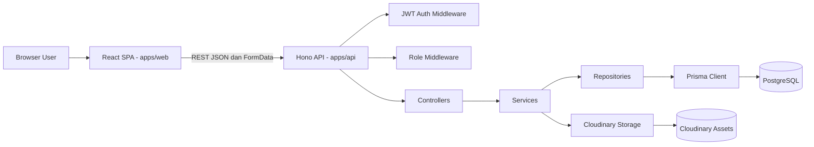
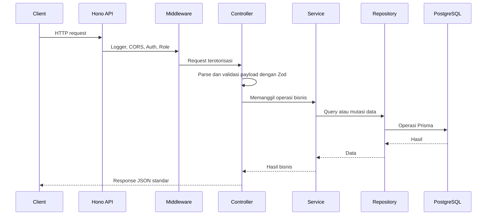
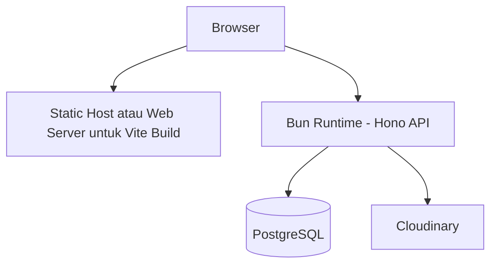
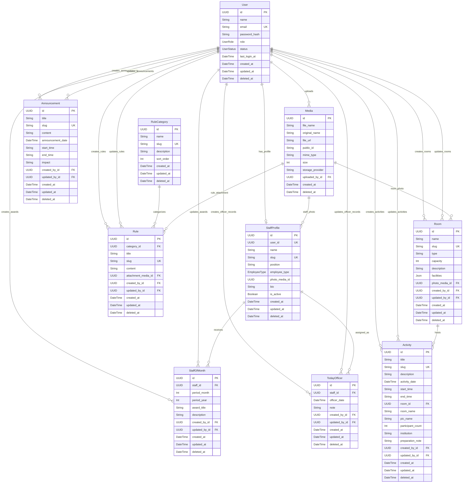

# DOKUMENTASI SISTEM INFOBASE UPPJPDS

## Kontrol Dokumen

| Item | Deskripsi |
| --- | --- |
| Judul Dokumen | Dokumentasi Teknis dan SRS INFOBASE UPPJPDS |
| Nama Sistem | INFOBASE UPPJPDS |
| Versi | 1.0 |
| Tanggal | 2026-07-03 |
| Disiapkan Dari | Repositori source code `/Users/sagara/project/freelance-perpus` |
| Standar Dokumentasi | Dokumentasi teknis terstruktur dengan pengenal kebutuhan bergaya SRS |
| Ruang Lingkup | Arsitektur, model data, ERD, API, kebutuhan fungsional dan non-fungsional SRS, serta analisis faktual source code |

## 1. Ringkasan Eksekutif

INFOBASE UPPJPDS adalah aplikasi informasi untuk UPT Perpustakaan Jakarta dan PDS H.B. Jassin. Sistem menyediakan portal publik, area internal petugas, dan panel administrasi untuk mengelola tata tertib, pengumuman, agenda, staff of the month, today officer, profil pegawai, profil ruangan, media, dan user.

Berdasarkan source code, sistem dibangun sebagai aplikasi web full-stack dengan pemisahan frontend dan backend:

| Layer | Implementasi |
| --- | --- |
| Frontend | Vite, React, TypeScript, React Router, TanStack React Query, React Hook Form, Zod, Tailwind CSS, Lucide React |
| Backend | Bun runtime, Hono REST API, TypeScript |
| Database | PostgreSQL melalui Prisma ORM |
| Authentication | JWT HS256 melalui `jose`, password hashing dengan `bcryptjs` |
| Authorization | Role-based access control: `PNS` dan `PJLP` |
| Media Storage | Cloudinary |
| Validation | Zod schema pada API dan form login frontend |

Sistem menerapkan arsitektur modular dan berlapis pada backend dengan pola `routes -> controller -> service -> repository -> Prisma`. Frontend menggunakan React SPA dengan protected route berbasis role dan konfigurasi generik untuk halaman CRUD admin.

## 2. Dasar Source Code

Dokumentasi ini disusun berdasarkan inspeksi file berikut:

| Area | Source Path |
| --- | --- |
| Project overview | `README.md` |
| API entry point | `apps/api/src/index.ts` |
| Backend modules | `apps/api/src/modules/*` |
| Backend middleware | `apps/api/src/middlewares/*` |
| Backend config | `apps/api/src/config/*` |
| Prisma schema | `apps/api/prisma/schema.prisma` |
| Migration SQL | `apps/api/prisma/migrations/20260617000000_init/migration.sql` |
| Seed data | `apps/api/prisma/seed.ts` |
| Frontend router | `apps/web/src/app/router.tsx` |
| Frontend auth provider | `apps/web/src/features/auth/AuthProvider.tsx` |
| Frontend admin config | `apps/web/src/pages/admin/adminConfigs.ts` |
| Frontend API client | `apps/web/src/services/api.ts` |

Fakta struktur source code:

| Metrik | Nilai |
| --- | --- |
| Backend module files under `apps/api/src/modules` | 62 file |
| Frontend source files under `apps/web/src` | 29 file |
| Prisma models | 10 model |
| Prisma enums | 3 enum |
| Local automated test files outside `node_modules` | Tidak ditemukan |
| Root `package.json` | Tidak ditemukan pada root repositori yang diinspeksi |
| `.env.example` files | Tidak ditemukan pada root repositori dan folder app |

## 3. Ruang Lingkup Sistem

### 3.1 Termasuk dalam Ruang Lingkup

Sistem mencakup:

1. Landing page informasi publik dan data infobase publik.
2. Login dan pengelolaan sesi terautentikasi.
3. Dashboard ringkasan internal untuk `PNS` dan `PJLP`.
4. Dashboard admin untuk `PNS`.
5. Pengelolaan CRUD untuk user, kategori tata tertib, tata tertib, pengumuman, aktivitas, staff of the month, today officer, profil pegawai, profil ruangan, dan media.
6. Upload media ke Cloudinary dan penyimpanan metadata di PostgreSQL.
7. Pagination, pencarian, dan filter tertentu pada endpoint list.
8. Strategi soft delete menggunakan `deleted_at`.

### 3.2 Di Luar Ruang Lingkup Source Code Saat Ini

Kemampuan berikut belum diimplementasikan sebagai fitur source code khusus:

1. Penyimpanan refresh token di server atau daftar pencabutan token.
2. Automated unit test, integration test, atau end-to-end test.
3. Rate limiting multi-instance atau distributed.
4. Tabel audit log yang terpisah dari `created_by_id` dan `updated_by_id`.
5. Pengiriman notifikasi.
6. Manajemen role selain nilai enum tetap `PNS` dan `PJLP`.
7. File orkestrasi root workspace lengkap, karena root `package.json` tidak ditemukan saat inspeksi.

## 4. Aktor dan Tingkat Akses

| Aktor | Deskripsi | Akses |
| --- | --- | --- |
| Public Visitor | Pengunjung website yang belum terautentikasi | Dapat melihat landing page publik dan daftar/detail infobase publik melalui endpoint `/api/public/*` |
| PJLP | User internal terautentikasi dengan role `PJLP` | Dapat mengakses `/app/infobase` dan endpoint baca yang terautentikasi |
| PNS | User internal terautentikasi dengan role `PNS` | Dapat mengakses aplikasi internal, dashboard admin, dan seluruh endpoint CRUD `/api/admin/*` |
| System | Runtime backend dan database | Menjalankan validasi, autentikasi, otorisasi, persistensi, upload media, soft delete, dan agregasi ringkasan |

## 5. Arsitektur

### 5.1 Gaya Arsitektur

Source code menggunakan pemisahan bergaya modular monorepo antara frontend dan backend:

```text
apps/
  api/    Hono REST API, Prisma ORM, akses PostgreSQL, integrasi media Cloudinary
  web/    Vite React SPA, route guard, public pages, halaman aplikasi internal, admin panel
```

Backend mengikuti arsitektur modular berlapis:

```text
HTTP request
  -> Hono route
  -> middleware
  -> controller
  -> service
  -> repository
  -> Prisma Client
  -> PostgreSQL
```

Public API controller merupakan pengecualian: `apps/api/src/modules/public/public.controller.ts` langsung menggunakan Prisma tanpa melalui file service/repository. Ini adalah deviasi arsitektur faktual dari pola utama modul backend.

### 5.2 Diagram Arsitektur Logis



### 5.3 Tanggung Jawab Layer Backend

| Layer | Tanggung Jawab | Contoh Source |
| --- | --- | --- |
| Entry Point | Membuat Hono app, mengatur logger, CORS, route mounting, health check, not found, dan error middleware | `apps/api/src/index.ts` |
| Route | Menentukan HTTP method, path, authentication, dan role middleware | `apps/api/src/modules/*/*.routes.ts` |
| Middleware | JWT authentication, role authorization, login rate limiting, error response | `apps/api/src/middlewares/*` |
| Controller | Melakukan parse request, menjalankan validasi schema, memanggil service, dan mengembalikan response standar | `apps/api/src/modules/*/*.controller.ts` |
| Service | Business logic, slug generation, content sanitization, password hashing, operasi Cloudinary, audit metadata | `apps/api/src/modules/*/*.service.ts` |
| Repository | Prisma query, pagination, search, filter, include relation, soft delete | `apps/api/src/modules/*/*.repository.ts`, `apps/api/src/utils/crud.ts` |
| Persistence | Prisma schema, migrations, database connection singleton | `apps/api/prisma/schema.prisma`, `apps/api/src/database/prisma.ts` |

### 5.4 Arsitektur Frontend

Frontend adalah React SPA dengan tiga kelompok route utama:

| Kelompok Route | Tujuan | Akses |
| --- | --- | --- |
| `/` | Landing page publik dan konten infobase publik | Publik |
| `/login` | Halaman autentikasi | Publik |
| `/app/infobase` | Ringkasan informasi internal | `PNS`, `PJLP` |
| `/admin/*` | Dashboard admin dan pengelolaan resource | Khusus `PNS` |

Fakta implementasi frontend:

1. Request API dipusatkan di `apps/web/src/services/api.ts`.
2. JWT token disimpan di browser `localStorage` dengan key `infobase_token`.
3. `AuthProvider` memuat `/auth/me` ketika token tersedia.
4. `ProtectedRoute` mengarahkan user yang belum terautentikasi ke `/login`.
5. `ProtectedRoute` mengarahkan user dengan role tidak valid ke path home sesuai role.
6. Home path `PNS` adalah `/admin/dashboard`.
7. Home path `PJLP` adalah `/app/infobase`.
8. Halaman CRUD admin dibuat dari `adminConfigs`.

### 5.5 Alur Request Backend



### 5.6 Tampilan Deployment



## 6. Arsitektur Data

### 6.1 Teknologi Database

Layer database menggunakan PostgreSQL dengan Prisma ORM. Datasource dikonfigurasi di `apps/api/prisma/schema.prisma`:

```prisma
datasource db {
  provider = "postgresql"
  url      = env("DATABASE_URL")
}
```

### 6.2 Prisma Enums

| Enum | Nilai | Penggunaan |
| --- | --- | --- |
| `UserRole` | `PNS`, `PJLP` | Role otorisasi user |
| `UserStatus` | `ACTIVE`, `INACTIVE` | Status akun user |
| `EmployeeType` | `PNS`, `PJLP` | Jenis pegawai pada profil staff |

### 6.3 ERD



### 6.4 Kamus Data

| Entitas | Tabel | Tujuan |
| --- | --- | --- |
| User | `users` | Akun untuk login dan otorisasi |
| StaffProfile | `staff_profiles` | Informasi profil staff/PJLP/PNS |
| RuleCategory | `rule_categories` | Master data kategori untuk tata tertib |
| Rule | `rules` | Konten tata tertib perpustakaan dan staff |
| Announcement | `announcements` | Pengumuman operasional |
| Activity | `activities` | Agenda, event, booking, penggunaan ruangan |
| Room | `rooms` | Profil ruangan, kapasitas, fasilitas, dan foto |
| StaffOfMonth | `staff_of_month` | Catatan apresiasi staff bulanan |
| TodayOfficer | `today_officers` | Catatan penugasan petugas harian |
| Media | `media` | Metadata file upload yang disimpan di Cloudinary |

### 6.5 Constraint dan Index Database

| Tabel | Constraint atau Index |
| --- | --- |
| `users` | Email unik |
| `staff_profiles` | `user_id` unik, `slug` unik |
| `rule_categories` | `slug` unik |
| `rules` | `slug` unik, index `category_id` |
| `announcements` | `slug` unik |
| `activities` | `slug` unik, index `activity_date` |
| `rooms` | `slug` unik |
| `staff_of_month` | Index `period_year, period_month` |
| `today_officers` | Index `officer_date` |
| `media` | Foreign key ke user pengunggah |

Sebagian besar tabel bisnis menerapkan soft delete melalui nullable `deleted_at`. Query list umumnya memfilter `deleted_at: null`.

## 7. Ringkasan Spesifikasi API

### 7.1 Format Response

Success response:

```json
{
  "success": true,
  "message": "Data berhasil diambil",
  "data": {}
}
```

Paginated response:

```json
{
  "success": true,
  "message": "Data berhasil diambil",
  "data": [],
  "meta": {
    "page": 1,
    "limit": 10,
    "total": 0,
    "totalPages": 1
  }
}
```

Failure response:

```json
{
  "success": false,
  "message": "Validasi gagal",
  "errors": []
}
```

### 7.2 Public Endpoints

Base path: `/api/public`

| Method | Path | Deskripsi |
| --- | --- | --- |
| GET | `/infobase/summary` | Ringkasan publik |
| GET | `/rule-categories` | Daftar kategori tata tertib |
| GET | `/rules` | Daftar tata tertib |
| GET | `/rules/:slug` | Detail tata tertib |
| GET | `/announcements` | Daftar pengumuman |
| GET | `/announcements/:slug` | Detail pengumuman |
| GET | `/activities` | Daftar aktivitas |
| GET | `/activities/today` | Daftar aktivitas berdasarkan tanggal hari ini atau tanggal yang diminta |
| GET | `/activities/:id` | Detail aktivitas |
| GET | `/staff-of-month` | Daftar staff of month |
| GET | `/staff-of-month/:id` | Detail staff of month |
| GET | `/today-officer` | Daftar today officer |
| GET | `/staff` | Daftar profil staff |
| GET | `/staff/:slug` | Detail profil staff |
| GET | `/rooms` | Daftar profil ruangan |
| GET | `/rooms/:slug` | Detail profil ruangan |

### 7.3 Authentication Endpoints

Base path: `/api/auth`

| Method | Path | Auth | Deskripsi |
| --- | --- | --- | --- |
| POST | `/login` | Publik | Memvalidasi email/password dan mengembalikan JWT |
| POST | `/logout` | Bearer token | Mengembalikan response logout berhasil |
| GET | `/me` | Bearer token | Mengembalikan profil user aktif yang terautentikasi |

### 7.4 Authenticated Read Endpoints

Base path: `/api`

| Method | Path | Role | Deskripsi |
| --- | --- | --- | --- |
| GET | `/infobase/summary` | `PNS`, `PJLP` | Ringkasan internal |
| GET | `/rule-categories` | `PNS`, `PJLP` | Daftar kategori tata tertib |
| GET | `/rules` | `PNS`, `PJLP` | Daftar tata tertib |
| GET | `/rules/:slug` | `PNS`, `PJLP` | Detail tata tertib |
| GET | `/announcements` | `PNS`, `PJLP` | Daftar pengumuman |
| GET | `/announcements/:slug` | `PNS`, `PJLP` | Detail pengumuman |
| GET | `/activities` | `PNS`, `PJLP` | Daftar aktivitas |
| GET | `/activities/today` | `PNS`, `PJLP` | Daftar aktivitas hari ini |
| GET | `/activities/:id` | `PNS`, `PJLP` | Detail aktivitas |
| GET | `/staff-of-month` | `PNS`, `PJLP` | Daftar staff of month |
| GET | `/today-officer` | `PNS`, `PJLP` | Daftar today officer |
| GET | `/staff` | `PNS`, `PJLP` | Daftar profil staff |
| GET | `/staff/:slug` | `PNS`, `PJLP` | Detail profil staff |
| GET | `/rooms` | `PNS`, `PJLP` | Daftar profil ruangan |
| GET | `/rooms/:slug` | `PNS`, `PJLP` | Detail profil ruangan |

### 7.5 Admin Endpoints

Base path: `/api/admin`. Seluruh admin endpoints membutuhkan Bearer token dan role `PNS`.

| Resource | Method dan Path |
| --- | --- |
| Users | `GET /users`, `POST /users`, `PATCH /users/:id`, `DELETE /users/:id` |
| Rule Categories | `POST /rule-categories`, `PATCH /rule-categories/:id`, `DELETE /rule-categories/:id` |
| Rules | `POST /rules`, `PATCH /rules/:id`, `DELETE /rules/:id` |
| Announcements | `POST /announcements`, `PATCH /announcements/:id`, `DELETE /announcements/:id` |
| Activities | `POST /activities`, `PATCH /activities/:id`, `DELETE /activities/:id` |
| Staff of Month | `POST /staff-of-month`, `PATCH /staff-of-month/:id`, `DELETE /staff-of-month/:id` |
| Today Officer | `POST /today-officer`, `PATCH /today-officer/:id`, `DELETE /today-officer/:id` |
| Staff Profiles | `POST /staff`, `PATCH /staff/:id`, `DELETE /staff/:id` |
| Room Profiles | `POST /rooms`, `PATCH /rooms/:id`, `DELETE /rooms/:id` |
| Media | `GET /media`, `POST /media/upload`, `DELETE /media/:id` |

### 7.6 Query Parameters

| Parameter | Penggunaan |
| --- | --- |
| `q` | Pencarian case-insensitive pada field yang dikonfigurasi |
| `page` | Nomor halaman, minimum 1 |
| `limit` | Ukuran halaman, minimum 1 dan maksimum 100 |
| `date` | Filter tanggal untuk pengumuman, aktivitas, today officer, dan summary |
| `category` | Filter slug kategori tata tertib |
| `month` | Filter bulan periode staff of month |
| `year` | Filter tahun periode staff of month |
| `employee_type` | Filter staff berdasarkan `PNS` atau `PJLP` |

## 8. Spesifikasi Kebutuhan Perangkat Lunak

### 8.1 Kebutuhan Fungsional

| ID | Kebutuhan | Aktor | Prioritas | Bukti Sumber |
| --- | --- | --- | --- | --- |
| FR-001 | Sistem harus menyediakan landing page publik dengan kategori informasi publik dan data ringkasan. | Public Visitor | Must | `LandingPage.tsx`, `public.routes.ts` |
| FR-002 | Sistem harus menyediakan tampilan daftar dan detail publik untuk tata tertib, pengumuman, aktivitas, staff of month, staff, dan ruangan. | Public Visitor | Must | `public.controller.ts`, `LandingPage.tsx` |
| FR-003 | Sistem harus mengautentikasi user menggunakan email dan password. | PNS, PJLP | Must | `auth.controller.ts`, `auth.service.ts`, `LoginPage.tsx` |
| FR-004 | Sistem harus menolak user tidak aktif dan kredensial tidak valid saat login. | System | Must | `auth.service.ts` |
| FR-005 | Sistem harus membuat JWT access token yang berisi subject, email, role, issue time, expiration time, dan tanda tangan HS256. | System | Must | `jwt.ts` |
| FR-006 | Sistem harus menyediakan `/auth/me` untuk memvalidasi sesi saat ini dan mengembalikan data user terautentikasi. | PNS, PJLP | Must | `auth.routes.ts`, `AuthProvider.tsx` |
| FR-007 | Sistem harus membatasi `/app/infobase` hanya untuk user terautentikasi `PNS` dan `PJLP`. | System | Must | `router.tsx`, `ProtectedRoute.tsx` |
| FR-008 | Sistem harus membatasi route frontend `/admin/*` dan route API `/api/admin/*` hanya untuk user `PNS`. | System | Must | `router.tsx`, `role.middleware.ts`, `*.routes.ts` |
| FR-009 | Sistem harus menampilkan ringkasan internal yang berisi tanggal, menu, today officer, aktivitas hari ini, pengumuman terbaru, staff of month, dan metrik jumlah. | PNS, PJLP | Must | `infobase.repository.ts`, `AppInfobasePage.tsx` |
| FR-010 | Sistem harus menyediakan dashboard PNS dengan jumlah tata tertib, pengumuman, aktivitas, staff, ruangan, dan today officer. | PNS | Must | `AdminDashboard.tsx` |
| FR-011 | Sistem harus memungkinkan user PNS membuat, menampilkan, memperbarui, mencari, dan melakukan soft delete akun user. | PNS | Must | `users.routes.ts`, `users.service.ts`, `AdminResourcePage.tsx` |
| FR-012 | Sistem harus melakukan hash password user sebelum menyimpannya. | System | Must | `users.service.ts` |
| FR-013 | Sistem harus memungkinkan user PNS mengelola kategori tata tertib. | PNS | Must | `rule-categories.*.ts`, `adminConfigs.ts` |
| FR-014 | Sistem harus memungkinkan user PNS mengelola tata tertib dengan relasi kategori dan attachment media opsional. | PNS | Must | `rules.*.ts`, `adminConfigs.ts` |
| FR-015 | Sistem harus membuat slug untuk kategori, tata tertib, pengumuman, aktivitas, staff, dan ruangan dari nama atau judul. | System | Must | `slugify.ts`, file service modul |
| FR-016 | Sistem harus memungkinkan user PNS mengelola pengumuman dengan field tanggal, waktu, dampak, dan konten. | PNS | Must | `announcements.*.ts`, `announcements.schema.ts` |
| FR-017 | Sistem harus memungkinkan user PNS mengelola aktivitas dengan field tanggal, waktu, ruangan, PIC, jumlah peserta, instansi, catatan persiapan, dan deskripsi. | PNS | Must | `activities.*.ts`, `activities.schema.ts` |
| FR-018 | Sistem harus memungkinkan user PNS mengelola catatan staff of the month berdasarkan staff, bulan, tahun, title, dan deskripsi. | PNS | Must | `staff-of-month.*.ts` |
| FR-019 | Sistem harus memungkinkan user PNS mengelola today officer berdasarkan staff, tanggal officer, dan catatan. | PNS | Must | `today-officer.*.ts` |
| FR-020 | Sistem harus memungkinkan user PNS mengelola profil staff dengan relasi user, nama, jabatan, jenis pegawai, foto, bio, dan flag aktif. | PNS | Must | `staff.*.ts`, `staff.schema.ts` |
| FR-021 | Sistem harus memungkinkan user PNS mengelola profil ruangan dengan type, kapasitas, fasilitas, foto, dan deskripsi. | PNS | Must | `rooms.*.ts`, `rooms.schema.ts` |
| FR-022 | Sistem harus memungkinkan user PNS mengunggah, menampilkan, dan menghapus file media. | PNS | Must | `media.*.ts`, `AdminMediaPage.tsx` |
| FR-023 | Sistem harus menyimpan metadata media Cloudinary di tabel `media`. | System | Must | `cloudinary.storage.ts`, `media.repository.ts` |
| FR-024 | Sistem harus mendukung pagination pada endpoint list dengan limit maksimum 100. | System | Must | `pagination.ts` |
| FR-025 | Sistem harus mendukung pencarian teks case-insensitive pada field yang dikonfigurasi. | PNS, PJLP, Public Visitor | Should | `pagination.ts`, file repository |
| FR-026 | Sistem harus mendukung filter berbasis tanggal untuk pengumuman, aktivitas, today officer, dan summary. | PNS, PJLP, Public Visitor | Should | `date-range.ts`, file repository |
| FR-027 | Sistem harus melakukan sanitasi konten HTML untuk field rich text tertentu sebelum persistence. | System | Must | `sanitize.ts`, file service |
| FR-028 | Sistem harus mengembalikan response JSON standar untuk success, paginated, dan failure. | System | Must | `api-response.ts` |

### 8.2 Kebutuhan Non-Fungsional

| ID | Kebutuhan | Kategori | Implementasi Saat Ini |
| --- | --- | --- | --- |
| NFR-001 | Sistem harus mengautentikasi akses API menggunakan Bearer JWT token. | Security | Diimplementasikan di `auth.middleware.ts` |
| NFR-002 | Sistem harus mengotorisasi operasi admin berdasarkan role `PNS`. | Security | Diimplementasikan di `role.middleware.ts` dan admin routes |
| NFR-003 | Sistem harus melakukan hash password sebelum penyimpanan. | Security | Diimplementasikan dengan `bcryptjs`, cost factor 12 |
| NFR-004 | Sistem harus memvalidasi request body API sebelum mutasi. | Reliability | Diimplementasikan dengan file schema Zod |
| NFR-005 | Sistem harus mengurangi risiko XSS pada field rich-text yang disimpan. | Security | Diimplementasikan dengan `sanitize-html`, allowed tags, dan attributes |
| NFR-006 | Sistem harus melakukan rate-limit percobaan login. | Security | Diimplementasikan in-memory: 20 percobaan per IP dan 10 per email per 15 menit |
| NFR-007 | Sistem harus membatasi cross-origin request ke origin frontend yang dikonfigurasi. | Security | Diimplementasikan dengan Hono CORS menggunakan `env.WEB_URL` |
| NFR-008 | Sistem harus melindungi ukuran upload dan MIME type. | Security | Gambar: JPEG/PNG/WebP, default maksimal 3 MB. PDF: default maksimal 10 MB |
| NFR-009 | Sistem harus menyediakan penanganan error API yang konsisten. | Maintainability | Global `errorMiddleware` mengembalikan response failure 500 standar |
| NFR-010 | Sistem harus mendukung referential integrity database. | Data Integrity | Diimplementasikan melalui foreign key Prisma migration |
| NFR-011 | Sistem harus menghindari hard deletion untuk business records. | Data Integrity | Diimplementasikan menggunakan soft delete `deleted_at` di repository |
| NFR-012 | Sistem harus mendukung page-based pagination untuk menghindari result set tanpa batas. | Performance | Diimplementasikan dengan `page`, `limit`, `skip`, `take`, limit maksimum 100 |
| NFR-013 | Sistem harus menyediakan health-check endpoint. | Operability | Diimplementasikan sebagai `GET /health` |
| NFR-014 | Sistem harus dapat dikonfigurasi melalui environment variables. | Portability | Diimplementasikan di `config/env.ts` |
| NFR-015 | Sistem harus mendukung basic request logging. | Observability | Diimplementasikan dengan middleware Hono `logger()` |
| NFR-016 | Sistem harus dapat dicek tipe secara statis. | Maintainability | Script API dan Web menggunakan `tsc --noEmit` |
| NFR-017 | Sistem sebaiknya menyediakan automated tests untuk flow kritis. | Testability | Tidak ditemukan pada source code saat ini |

## 9. Aturan Validasi

| Modul | Aturan Validasi Utama |
| --- | --- |
| Auth | Email harus valid; password minimal 8 karakter |
| Users | Nama minimal 2; email valid; password minimal 8; role `PNS` atau `PJLP`; status `ACTIVE` atau `INACTIVE` |
| Rule Categories | Nama minimal 2; sort order integer minimal 0 |
| Rules | Category ID harus UUID; title minimal 2; content minimal 3; attachment media ID opsional harus UUID |
| Announcements | Title minimal 2; content minimal 3; announcement date dikonversi menjadi Date |
| Activities | Title minimal 2; activity date dikonversi menjadi Date; room ID UUID opsional; participant count opsional berupa positive integer |
| Staff of Month | Staff ID UUID; bulan 1-12; tahun 1900-2200; award title minimal 2 |
| Today Officer | Staff ID UUID; officer date dikonversi menjadi Date |
| Staff Profiles | User ID UUID opsional; employee type `PNS` atau `PJLP`; name dan position minimal 2 |
| Rooms | Name dan type minimal 2; description minimal 3; capacity opsional berupa positive integer; facilities opsional berupa array string |
| Media | Folder enum: `staff`, `rooms`, `rules`, `announcements`, `general`; file wajib ada |

## 10. Arsitektur Keamanan

### 10.1 Authentication

1. Request login divalidasi menggunakan Zod.
2. User dicari berdasarkan email dengan `deleted_at: null`.
3. Login gagal jika user tidak ditemukan atau status bukan `ACTIVE`.
4. Password diperiksa dengan `bcrypt.compare`.
5. `last_login_at` diperbarui setelah validasi kredensial berhasil.
6. JWT access token ditandatangani menggunakan HS256.
7. Payload token berisi `sub`, `email`, `role`, dan `type: "access"`.
8. Expiration token default adalah `1d` kecuali `JWT_EXPIRES_IN` dikonfigurasi.

### 10.2 Authorization

API menggunakan role middleware:

| Area | Role yang Dibutuhkan |
| --- | --- |
| Public API `/api/public/*` | Tidak membutuhkan authentication |
| Authenticated read API | Bearer token valid |
| Admin API `/api/admin/*` | Bearer token valid dan `PNS` |
| Frontend `/app/*` | `PNS` atau `PJLP` |
| Frontend `/admin/*` | `PNS` |

### 10.3 Perlindungan Input dan Output

| Kontrol | Implementasi |
| --- | --- |
| Request validation | Zod schemas |
| HTML sanitization | `sanitize-html` dengan restricted tags dan link attributes |
| Password storage | Hanya bcrypt hash; password hash dikecualikan dari response user list |
| Upload validation | Validasi MIME dan ukuran file sebelum upload Cloudinary |
| CORS | Origin dibatasi ke `WEB_URL` |
| Login abuse protection | In-memory rate limiter |

### 10.4 Pertimbangan Keamanan

1. JWT disimpan di `localStorage` pada frontend. Ini sederhana, tetapi meningkatkan dampak jika XSS terjadi.
2. Logout tidak mencabut JWT di server-side; logout hanya menghapus token client dan mengembalikan success dari API.
3. Login rate limiting bersifat in-memory, sehingga limit reset saat proses restart dan tidak dibagikan di beberapa instance API.
4. Unique database indexes bukan partial indexes, sehingga pembuatan ulang email atau slug yang sudah soft-deleted dapat berbenturan dengan baris soft-deleted sebelumnya.
5. Operasi update repository umumnya melakukan update langsung berdasarkan `id` dan tidak selalu menerapkan `deleted_at: null` saat update.

## 11. Konfigurasi

### 11.1 Environment Variables Backend

| Variable | Wajib | Deskripsi |
| --- | --- | --- |
| `DATABASE_URL` | Ya | URL koneksi PostgreSQL |
| `JWT_ACCESS` | Ya jika tidak ada fallback | JWT signing secret, minimal 16 karakter |
| `JWT_SECRET` | Fallback opsional | Fallback yang diterima untuk JWT secret |
| `SECRET_KEY_TRUNTL` | Fallback opsional | Fallback yang diterima untuk JWT secret |
| `JWT_EXPIRES_IN` | Tidak | Durasi expiry token, default `1d` |
| `NODE_ENV` | Tidak | `development`, `test`, atau `production`; default `development` |
| `PORT` | Tidak | Port API, default `3440` |
| `WEB_URL` | Tidak | Origin CORS, default `http://localhost:5173` |
| `API_URL` | Tidak | URL tampilan API, default dari port |
| `CLOUDINARY_NAME` | Wajib untuk upload | Cloudinary cloud name |
| `CLOUDINARY_CLOUD_NAME` | Alias opsional | Alias untuk Cloudinary cloud name |
| `CLOUDINARY_API_KEY` | Wajib untuk upload | Cloudinary API key |
| `CLOUDINARY_API_SECRET` | Wajib untuk upload | Cloudinary API secret |
| `CLOUDINARY_FOLDER` | Tidak | Folder root Cloudinary, default `infobase-uppjpds` |
| `MAX_IMAGE_SIZE_MB` | Tidak | Ukuran upload gambar, default `3` |
| `MAX_FILE_SIZE_MB` | Tidak | Ukuran upload PDF, default `10` |

### 11.2 Environment Variables Frontend

| Variable | Wajib | Deskripsi |
| --- | --- | --- |
| `VITE_API_URL` | Tidak | URL dasar API yang digunakan frontend |
| `NEXT_PUBLIC_API_URL` | Tidak | Fallback kompatibilitas URL dasar API |

Jika tidak ada variable frontend yang diatur, frontend menggunakan default `http://localhost:3440/api`.

## 12. Fakta Seed Data

File seed membuat atau memperbarui:

| Jenis Data | Fakta Seed |
| --- | --- |
| User | `pns@uppjpds.local` dengan role `PNS` |
| User | `pjlp@uppjpds.local` dengan role `PJLP` |
| Password | Demo password `Password123!` di-hash dengan bcrypt |
| Staff Profiles | Fenty Afriyeni, Diki Lukman Hakim, Ketut Susilo, Juliana Silva, Jonathan Patterson |
| Rule Categories | 10 record kategori tata tertib |
| Rules | Satu tata tertib untuk setiap kategori yang di-seed |
| Announcements | 5 record pengumuman bertanggal 2025-10-17 sampai 2025-10-21 |
| Rooms | Balai Sastra HB Jassin, Aula HB Jassin, Bilik Bercerita |
| Activities | 2 aktivitas bertanggal 2025-10-17 |
| Staff of Month | 3 penghargaan untuk Oktober 2025 |
| Today Officer | Fenty Afriyeni pada 2025-10-17 |

## 13. Perintah Operasional

Berdasarkan package scripts yang ditemukan di `apps/api/package.json` dan `apps/web/package.json`:

### 13.1 Backend

| Command | Tujuan |
| --- | --- |
| `bun --watch src/index.ts` | Menjalankan API dalam development mode dari `apps/api` |
| `bun src/index.ts` | Menjalankan API dari `apps/api` |
| `tsc --noEmit` | Type-check API |
| `prisma generate --schema prisma/schema.prisma` | Generate Prisma client |
| `prisma migrate dev --schema prisma/schema.prisma` | Menjalankan development migrations |
| `prisma db seed --schema prisma/schema.prisma` | Melakukan seed database |
| `prisma studio --schema prisma/schema.prisma` | Membuka Prisma Studio |

### 13.2 Frontend

| Command | Tujuan |
| --- | --- |
| `vite --host 0.0.0.0` | Menjalankan frontend development server dari `apps/web` |
| `tsc -b && vite build` | Build frontend |
| `vite preview --host 0.0.0.0` | Preview build frontend |
| `tsc --noEmit` | Type-check frontend |

## 14. Analisis Berdasarkan Source Code

### 14.1 Kekuatan

| Area | Analisis |
| --- | --- |
| Pemisahan jelas | Frontend dan backend dipisahkan di bawah `apps/web` dan `apps/api`. |
| Backend modular | Sebagian besar modul backend menggunakan pemisahan route, controller, service, repository, dan schema secara konsisten. |
| Validasi | Input mutasi menggunakan Zod schemas. |
| Authorization | Admin endpoints secara konsisten menggunakan `authMiddleware` dan `requireRole("PNS")`. |
| Integritas data | Prisma schema mendefinisikan foreign key, unique constraint, dan index. |
| Soft delete | Business records umumnya disembunyikan menggunakan `deleted_at: null`. |
| Integrasi media | Upload dan penghapusan Cloudinary diimplementasikan dengan metadata yang disimpan di database. |
| Konsistensi API | Response success, failure, dan paginated distandarkan secara terpusat. |
| Reuse frontend | Halaman CRUD admin digerakkan oleh konfigurasi, sehingga mengurangi logika halaman yang berulang. |

### 14.2 Risiko dan Gap

| Area | Temuan | Dampak |
| --- | --- | --- |
| Testing | Tidak ada automated test lokal yang ditemukan di luar `node_modules`. | Risiko regresi lebih tinggi untuk authentication, authorization, CRUD, dan media flows. |
| Token lifecycle | Logout tidak membatalkan token di server-side. | Token yang dicuri tetap valid hingga kedaluwarsa. |
| Token storage | Frontend menyimpan JWT di `localStorage`. | XSS dapat mengekspos token jika sanitasi atau kode frontend terkompromi. |
| Rate limiting | Login limiter bersifat in-memory. | Tidak andal di beberapa instance atau setelah proses restart. |
| Public controller pattern | Public controller langsung mengakses Prisma. | Konsistensi arsitektur dan reuse lebih rendah dibanding modul lain. |
| Soft delete uniqueness | Unique indexes bukan partial berdasarkan `deleted_at`. | Membuat ulang slug/email yang dihapus dapat gagal. |
| Update behavior | Generic repository update menggunakan update langsung berdasarkan `id`. | Baris soft-deleted dapat diperbarui jika ID digunakan secara langsung. |
| Root orchestration | Root `package.json` tidak ditemukan, sementara README menjelaskan command Bun level root. | Instruksi setup dapat tidak lengkap atau tidak sesuai pada snapshot repositori saat ini. |
| Environment samples | File `.env.example` tidak ditemukan. | Setup environment baru menjadi kurang reproducible. |
| Media delete transaction | Penghapusan Cloudinary dan soft delete database merupakan operasi terpisah. | Kegagalan sebagian dapat menyebabkan inkonsistensi storage/database. |

### 14.3 Rekomendasi

| Prioritas | Rekomendasi | Alasan |
| --- | --- | --- |
| High | Tambahkan automated tests untuk login, role access, CRUD happy paths, validation errors, dan validasi media upload. | Mencakup flow keamanan dan data yang kritis. |
| High | Tambahkan root `package.json` atau perbarui command README agar sesuai dengan repositori aktual. | Mengurangi ambiguitas setup. |
| High | Tambahkan file `.env.example` untuk backend dan frontend. | Meningkatkan reproducibility deployment dan onboarding. |
| Medium | Pindahkan logic public read ke service/repository layer atau shared query helpers. | Meningkatkan konsistensi arsitektur. |
| Medium | Tambahkan server-side token revocation atau strategi short-lived access token plus refresh token jika kebutuhan keamanan meningkat. | Meningkatkan kontrol sesi. |
| Medium | Ganti in-memory rate limiting dengan Redis atau shared store lain untuk production. | Mendukung horizontal scaling. |
| Medium | Lindungi operasi update dengan `deleted_at: null`. | Mencegah mutasi terhadap record soft-deleted. |
| Medium | Pertimbangkan partial unique indexes untuk slug/email soft-deleted jika bisnis membutuhkan pembuatan ulang. | Menyelaraskan uniqueness dengan perilaku soft delete. |
| Low | Tambahkan structured logging dan request ID. | Meningkatkan observability production. |

## 15. Matriks Ketertelusuran

| Fitur | Source Frontend | Source Backend | Source Database |
| --- | --- | --- | --- |
| Public portal | `LandingPage.tsx` | `public.routes.ts`, `public.controller.ts` | Beberapa read model |
| Login | `LoginPage.tsx`, `AuthProvider.tsx` | `auth.routes.ts`, `auth.controller.ts`, `auth.service.ts` | `users` |
| Route guard | `ProtectedRoute.tsx`, `router.tsx` | `auth.middleware.ts`, `role.middleware.ts` | `users.role`, `users.status` |
| Internal summary | `AppInfobasePage.tsx` | `infobase.routes.ts`, `infobase.repository.ts` | `rules`, `announcements`, `activities`, `staff_profiles`, `rooms`, `today_officers`, `staff_of_month` |
| Admin dashboard | `AdminDashboard.tsx` | `infobase.repository.ts` | Count queries |
| Admin CRUD | `AdminResourcePage.tsx`, `adminConfigs.ts` | File module route/controller/service/repository | Tabel model terkait |
| Media upload | `AdminMediaPage.tsx`, `MediaUploadControl` | `media.controller.ts`, `media.service.ts`, `cloudinary.storage.ts` | `media` |
| Pagination | `AdminResourcePage.tsx`, `LandingPage.tsx` | `pagination.ts`, repositories | Prisma `skip`, `take` |
| Search | `AdminResourcePage.tsx`, `LandingPage.tsx` | `contains()` dan field pencarian repository | Prisma string filters |
| Soft delete | Tombol hapus admin | Fungsi repository `softDelete()` | Kolom `deleted_at` |

## 16. Lampiran: Dependensi Teknologi Utama

### 16.1 Dependensi Backend

| Dependensi | Tujuan |
| --- | --- |
| `hono` | HTTP framework |
| `@hono/zod-validator` | Dependensi helper validasi Hono |
| `@prisma/client` | Client ORM database |
| `prisma` | Prisma CLI dan tooling schema |
| `bcryptjs` | Hashing dan verifikasi password |
| `jose` | Signing dan verifikasi JWT |
| `zod` | Runtime validation |
| `cloudinary` | Integrasi media storage |
| `sanitize-html` | HTML sanitization |

### 16.2 Dependensi Frontend

| Dependensi | Tujuan |
| --- | --- |
| `react`, `react-dom` | UI framework |
| `react-router-dom` | Client-side routing |
| `@tanstack/react-query` | Fetching dan caching server-state |
| `react-hook-form` | Form state |
| `@hookform/resolvers` | Integrasi Zod untuk form |
| `zod` | Frontend validation |
| `lucide-react` | Komponen icon |
| `tailwindcss` | Utility CSS framework |
| `vite` | Development dan build tool frontend |

## 17. Kesimpulan

INFOBASE UPPJPDS diimplementasikan sebagai aplikasi web full-stack TypeScript dengan frontend React SPA dan backend Hono REST API. Codebase sudah memiliki batas modular yang jelas, role-based access control, relational modeling berbasis Prisma, integrasi media Cloudinary, input validation, dan response API yang terstandarisasi.

Peningkatan terdekat yang paling kuat adalah automated tests, environment samples, orkestrasi project level root yang konsisten, serta kontrol session/rate-limit yang lebih kuat untuk production. Rekomendasi ini didasarkan pada struktur dan perilaku source code yang diamati secara langsung.
